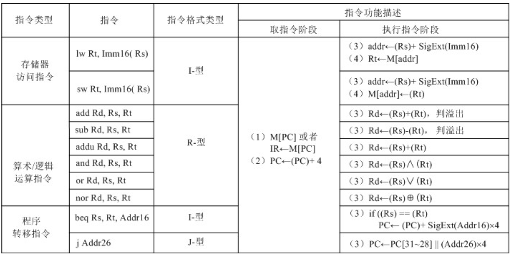
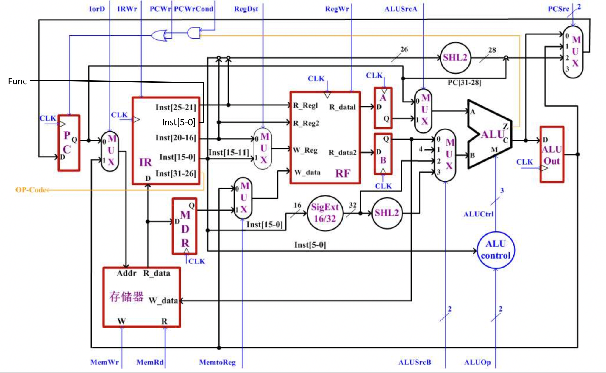
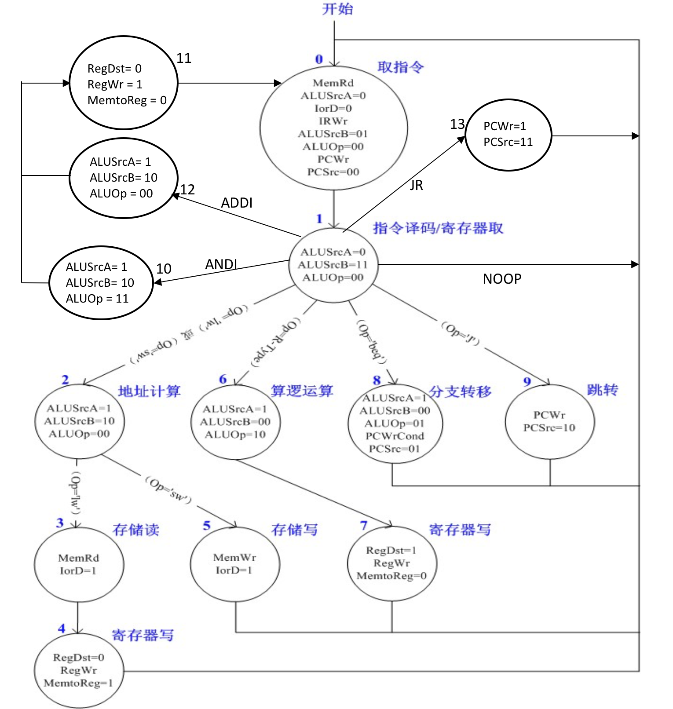
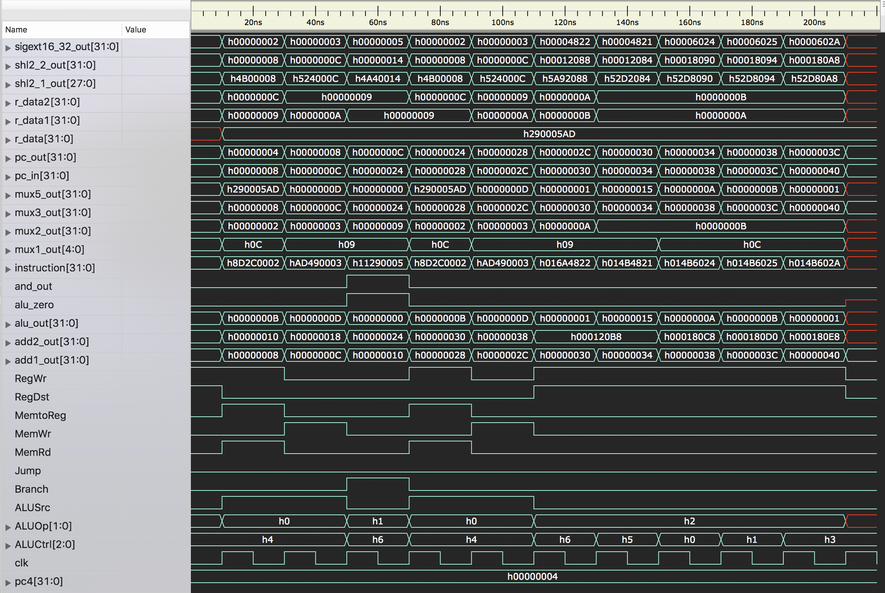
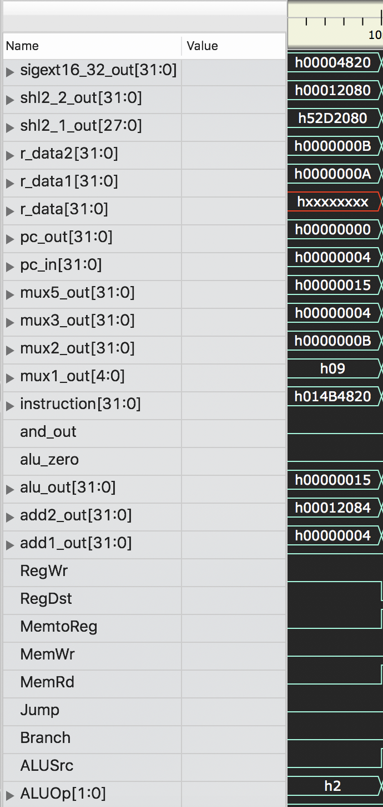
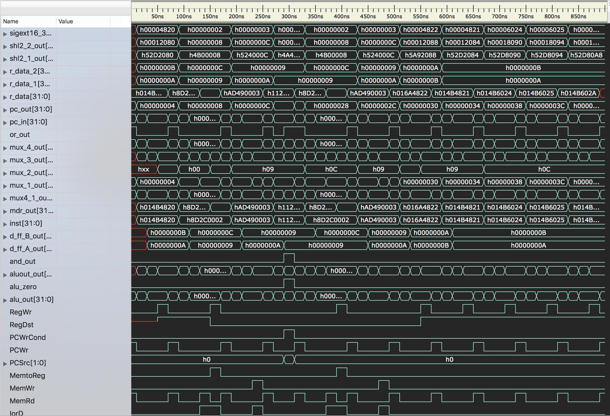
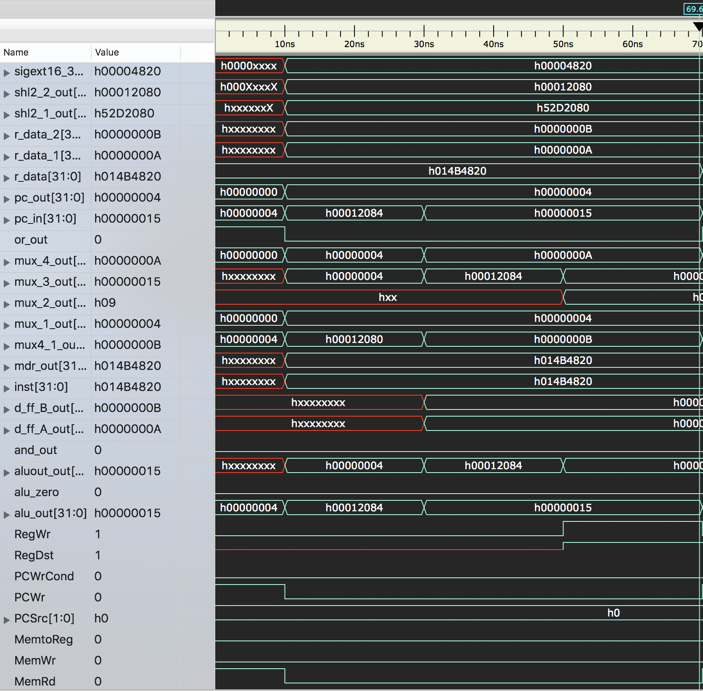
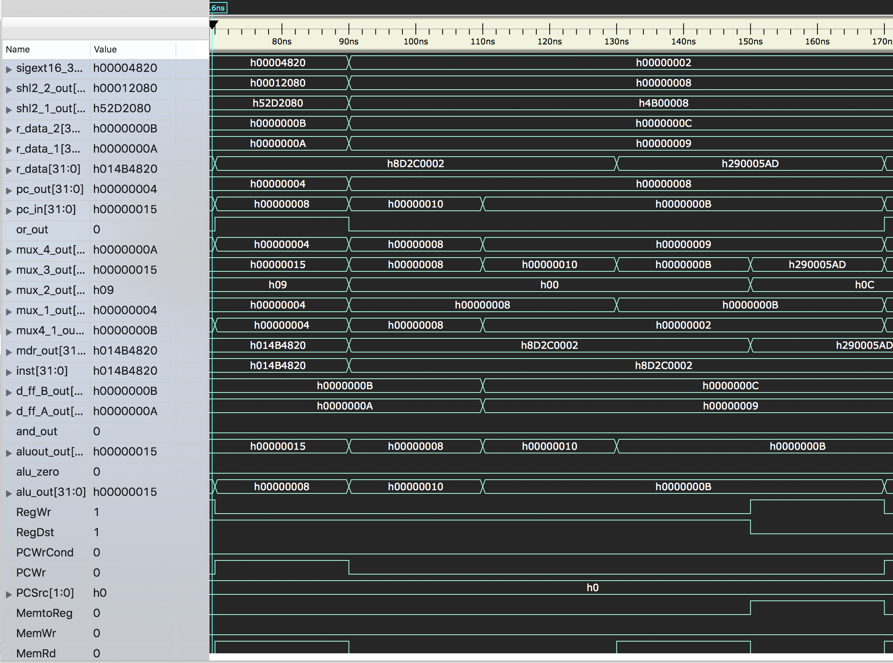
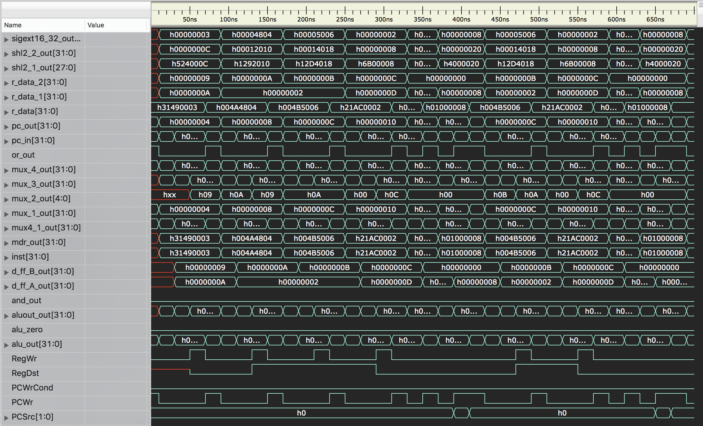
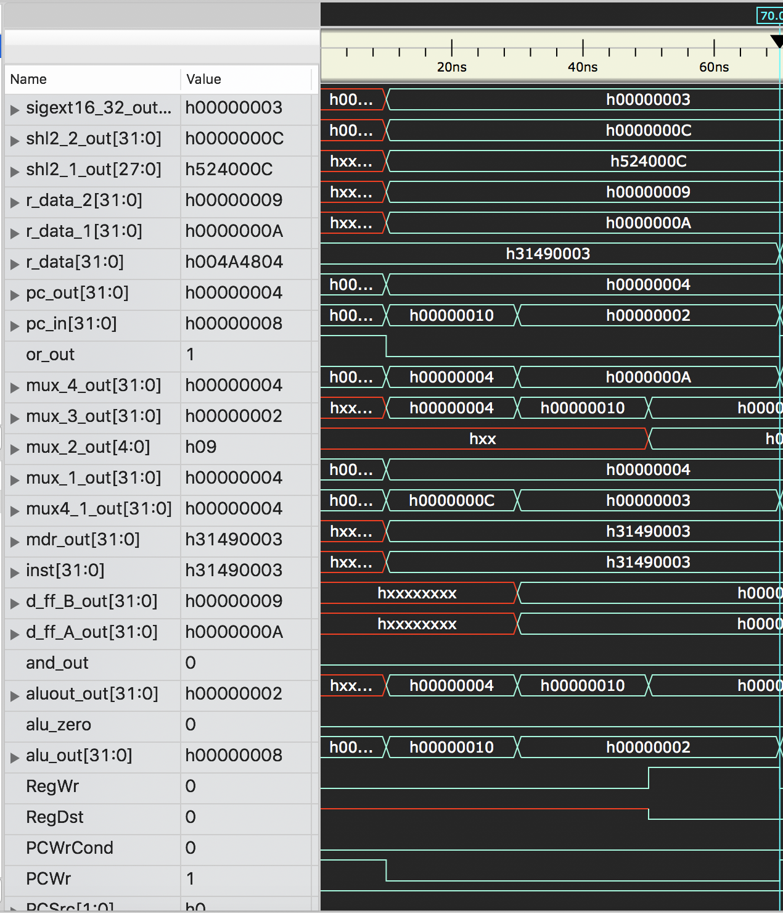

# 计算机组成实验报告

<center>李昂 2150201074</center>
## 实验目标

- 理解并设计单周期，多周期CPU的数据通路和控制器
- 自学verilog HDL语言，实现单周期，多周期CPU的仿真
- 添加一定量的新指令，对各个部分进行相应的调整以支持新指令


## 实验设计

- 实验平台：macOS Catalina 10.15.2

- verilog编译仿真工具：Icarus Verilog 10.3

- 波形查看工具：Scansion 1.12 

- MIPS汇编工具： Mars

  

### 单周期CPU设计

#### 数据通路


#### 指令集



### 多周期CPU设计

#### 数据通路

由于增加了指令，需要对数据通路做小改动，function code也应该送入控制器参与有限状态机的转换。




#### 指令集

除了书上的十条指令外，还支持另外6条指令

|       指令        |      操作       | 描述                                       |                  编码                   |
| :---------------: | :-------------: | :----------------------------------------- | :-------------------------------------: |
| andi \$t, $s, imm | $t = \$s & imm  | 将寄存器中的数与立即数按位与               | 0011 00ss ssst tttt iiii iiii iiii iiii |
| addi $t, \$s, imm | \$t = $s + imm  | 将寄存器中的数与立即数相加                 | 0010 00ss ssst tttt iiii iiii iiii iiii |
| sllv \$d, \$t, $s | \$d = \$t << $s | 将寄存器中的数按照另一寄存器中信息逻辑左移 | 0000 00ss ssst tttt dddd d--- --00 0100 |
| srlv \$d, $t, \$s | \$d = ​\$t >> $s | 将寄存器中的数按照另一寄存器中信息逻辑右移 | 0000 00ss ssst tttt dddd d000 0000 0110 |
|       jr $s       |     $PC=\$s     | 无条件跳转到寄存器中所存地址               | 0000 00ss sss0 0000 0000 0000 0000 1000 |
|       noop        |       无        | 空指令，仅仅只将PC加4                      | 0000 0000 0000 0000 0000 0000 0000 0000 |

#### ALU控制单元

由于增加了指令，ALU及其控制单元需要进行一些改变，比如添加更多的算术逻辑运算方式，改变后的真值表如下

| ALUOp | Funct  |  ALUCtrl  |
| :---: | :----: | :-------: |
|  00   |   X    | 100(ADD)  |
|  01   |   X    | 110(SUB)  |
|  10   | 100000 | 100(ADD)  |
|  10   | 100001 | 010(ADDU) |
|  10   | 100010 | 110(SUB)  |
|  10   | 100100 | 000(AND)  |
|  10   | 100101 |  001(OR)  |
|  10   | 101010 |  001(OR)  |
|  10   | 000100 | 010(SHL)  |
|  10   | 000110 | 111(SHR)  |
|  11   |   X    | 000(AND)  |

#### 主控制单元

多周期CPU中，主控制单元采取有限状态机的方式控制指令在各个阶段的信号发出，并在CLK等的激励下根据指令码切换到下一状态。由于添加了指令，需要更加复杂的有限状态机来满足要求。新的有限状态机如下图所示



## 实验验证

### 单周期CPU验证

#### 验证代码

```assembly
add $t1,$t2,$t3
lw $t4,2($t1)
sw $t1,3($t2)
beq  $t1,$t1,hi
j hi
add $t1,$t2,$t3
lw $t4,2($t1)
sw $t1,3($t2)
add $t1,$t2,$t3
hi:lw $t4,2($t1)
sw $t1,3($t2)
sub $t1,$t3,$t2
addu $t1,$t2,$t3
and $t4,$t2,$t3
or $t4,$t2,$t3
slt $t4,$t2,$t3

```

#### 内存文件

因为在这次实验中，内存是按照字节编址，按照字读取的，因此内存文件应该按照每行2位八进制代码书写。

```
20
48
4b
01
02
00
2c
8d
03
00
49
ad
05
00
29
11
09
00
00
08
20
48
4b
01
02
00
2c
8d
03
00
49
ad
20
48
4b
01
02
00
2c
8d
03
00
49
ad
22
48
6a
01
21
48
4b
01
24
60
4b
01
25
60
4b
01
2a
60
4b
01
```

#### 运行结果

运行以下命令

```
iverilog cpu_single.v
./a.out
scansion cpu.vcd
```

结果如下图



经过仔细验证，波形图与代码执行完全一一对应。

举例说明：

第一条指令`add $t1,$t2,$t3`



第一条指令`add $t1,$t2,$t3`，在控制器的作用下，成功从寄存器堆中取出加法的两个操作数0xA和0xB并计算结果为0x15，通过mux5送至寄存器堆的W_data端口，同时W_reg给出写入寄存器编号为t1，在下一个clk上升沿写入。

### 多周期CPU验证

对书上的标准十条指令的验证而言，可以使用与上文单周期一样的程序与内存文件

运行以下命令

```
iverilog cpu_multicycle.v
./a.out
scansion cpu_multicycle.vcd
```



经过仔细验证，波形图与代码执行完全一一对应。

举例说明:

第一条指令`add $t1,$t2,$t3`




首先可以看到控制器中的有限状态机切换是完全正确的，经历了0，1，6，7四个状态，与理论相符，在0状态时进行了取指令，1状态进行了译码和从寄存器堆取数据，6状态进行了ALU的运算，7状态进行了寄存器的写回。


第二条指令`lw $t4,2($t1)`




可以看到控制器中的有限状态机切换是完全正确的，经历了0，1，2，3，4五个状态阶段，与理论相符。0状态进行了取指令，1状态进行了译码和从寄存器读取数据，2状态计算了基址寄存器和偏移量的和，3阶段访问了主存，4阶段讲主存读出的数据写入了寄存器t4。

#### 额外指令的验证代码

```assembly
andi $t1,$t2,3
sllv $t1,$t2,$v0
srlv $t2,$t3,$v0
addi $t4,$t5,2
nop
jr $t0


```

#### 内存文件

```
03
00
49
31
04
48
4a
00
06
50
4b
00
02
00
ac
21
00
00
00
00
08
00
00
01		

```

#### 运行结果

将Memory.v中读入的内存数据换为以上内存内容，运行结果如下




经过仔细分析，波形图与添加的额外指令的预期一样，结果正确。

举例说明

第一条指令`andi $t1,$t2,3`




首先从控制器中重新设计后的有限状态机运行结果来看，ANDI这条指令如设计的一样，经历了状态0，1，10，11与理论相符。0状态进行了取指令，1状态进行了译码，从t2寄存器取出数据，状态10进行了与运算，状态11进行了I类指令的写回寄存器操作。

## 实验收获

本次实验首先完成了单周期的CPU设计与验证，然后完成了支持16条指令的多周期CPU设计与验证。通过本次实验，对数据通路和控制器熟悉了很多，尤其是对多周期控制器的有限状态机部分的原理和实现有了一定的研究。同时在实验过程中，对verilog HDL语言，硬件设计都有了一定的了解。

本实验已上传至github仓库：https://github.com/ang830715/MIPS_multi-cycle_cpu


## 代码附录

###单周期CPU综合模块

cpu_single.v：

```verilog
`include "Regfile.v"
`include "Memory.v"
`include "Add.v"
`include "Alucu.v"
`include "Mcu.v"
`include "Mux.v"
`include "Pc.v"
`include "Shl2_26bits.v"
`include "Shl2_32bits.v"
`include "Sigext16_32.v"
`include "Inst_memory.v"
`include "Alu.v"
`include "And.v"
`timescale 1ns/1ps
module cpu(
    
);  
    reg clk;
    reg[`WIDTH] pc4 ;
    wire[`WIDTH] pc_in, pc_out, instruction, add1_out,add2_out,r_data,r_data1,r_data2,sigext16_32_out,mux2_out,mux3_out,mux5_out,alu_out,shl2_2_out;
    wire[4:0] mux1_out;
    wire[27:0] shl2_1_out;
    wire RegDst, Jump, RegWr, Branch, MemtoReg, MemWr, MemRd, ALUSrc,alu_zero,and_out;
    wire[1:0] ALUOp ;
    wire[2:0] ALUCtrl;


   Pc pc(clk,pc_in,pc_out);
   Inst_memory inst_mem(pc_out, instruction);
   Add add1(pc4,pc_out,add1_out);
   Mux mux1(instruction[20:16],instruction[15:11],RegDst,mux1_out);
   Regfile regfile(clk,instruction[25:21],instruction[20:16],mux1_out,mux5_out,RegWr,r_data1,r_data2);
   Shl2_26bits shl2_1(instruction[25:0],shl2_1_out);
   Shl2_32bits shl2_2(sigext16_32_out,shl2_2_out);
   Add add2(add1_out,shl2_2_out,add2_out);
   And and1(Branch,alu_zero,and_out);
   Mux mux3(add1_out,add2_out,and_out,mux3_out);
   Mux mux4(mux3_out,{add1_out[31:28],shl2_1_out},Jump,pc_in);
   Sigext16_32 sigext16_32(instruction[15:0],sigext16_32_out);
   Mcu mcu(instruction[31:26],RegDst,Jump,RegWr,Branch,MemtoReg,ALUOp,MemWr,MemRd,ALUSrc);
   Mux mux2(r_data2,sigext16_32_out,ALUSrc,mux2_out);
   Alucu alucu(ALUOp,instruction[5:0],ALUCtrl);
   Alu alu(r_data1,mux2_out,ALUCtrl,alu_out,alu_zero);
   Memory memory(MemRd,MemWr,alu_out,r_data2,r_data);
   Mux mux5(alu_out,r_data,MemtoReg,mux5_out);


   
   always #10 
   begin     
   clk <= ~clk;  
   end
   
   initial begin    
   #0 begin         
    clk <= 1'b0;    
    pc4 <= 3'b100;  
    
    end
    #220 begin
        $finish;
    end
     end

    // initial begin
    //     assign pc_out =0;
    // end
   
    
    initial begin
        $dumpfile("cpu.vcd");
        $dumpvars(0, cpu);
      end
    


endmodule // cpu
```

### 多周期CPU综合模块

cpu_multicycle.v：

```verilog
`include "Regfile.v"
`include "Memory.v"
`include "Add.v"
`include "Or.v"
`include "Alucu.v"
`include "IR.v"
`include "D_ff.v"

`include "Mux.v"
`include "Mux4.v"
`include "Pc_multicycle.v"
`include "Shl2_26bits.v"
`include "Shl2_32bits.v"
`include "Sigext16_32.v"

`include "Alu.v"
`include "And.v"
`include "Controller.v"
`timescale 1ns/1ps

module cpu_multicycle(
    
);
    reg clk;
    wire[`WIDTH] mux_1_out,mux_3_out,mux_4_out,mux4_1_out;
    wire[`WIDTH] pc_in, pc_out, inst,r_data, r_data_1,r_data_2, aluout_out, d_ff_B_out, d_ff_A_out,mdr_out, sigext16_32_out,shl2_2_out,alu_out;
    wire [1:0] ALUOp, ALUSrcB, PCSrc;
    wire [2:0] ALUCtrl;
    wire PCWrCond, PCWr , IorD, MemRd, MemWr, MemtoReg, IRWr, ALUSrcA, RegWr, RegDst,alu_zero,and_out,or_out;
    wire[4:0] mux_2_out;
    wire[27:0] shl2_1_out;
    reg [`WIDTH] pc4;


    Controller controller(clk,  inst[31:26], inst[5:0],PCWrCond, PCWr , IorD, MemRd, MemWr, MemtoReg, IRWr, PCSrc, ALUOp, ALUSrcB, ALUSrcA, RegWr, RegDst);
    Pc_multicycle pc(clk, or_out,pc_in,pc_out);
    Mux mux_1(pc_out,aluout_out,IorD,mux_1_out);
    IR ir(clk,IRWr,r_data,inst);
    Memory memory(MemRd,MemWr,mux_1_out,d_ff_B_out,r_data);
    D_ff mdr(clk,r_data,mdr_out);
    Mux mux_2(inst[20:16],inst[15:11],RegDst,mux_2_out);
    Mux mux_3(aluout_out,mdr_out,MemtoReg,mux_3_out);
    Regfile regfile(clk,inst[25:21],inst[20:16],mux_2_out,mux_3_out,RegWr,r_data_1,r_data_2);
    Sigext16_32 sigext16_32(inst[15:0],sigext16_32_out);
    Shl2_32bits shl2_2(sigext16_32_out,shl2_2_out);
    D_ff d_ff_A (clk,r_data_1,d_ff_A_out);
    D_ff d_ff_B (clk,r_data_2,d_ff_B_out);
    Mux mux_4(pc_out,d_ff_A_out,ALUSrcA,mux_4_out);
    Mux4 mux4_1(d_ff_B_out,pc4,sigext16_32_out,shl2_2_out,ALUSrcB,mux4_1_out);
    Shl2_26bits shl2_1(inst[25:0],shl2_1_out);
    Alu alu(mux_4_out,mux4_1_out,ALUCtrl,alu_out,alu_zero);
    Alucu alucu(ALUOp,inst[5:0],ALUCtrl);
    D_ff aluout(clk,alu_out,aluout_out);
    Mux4 mux4_2(alu_out,aluout_out,{pc_out[31:28],shl2_1_out},d_ff_A_out,PCSrc,pc_in);
    And and1(PCWrCond,alu_zero,and_out);
    Or or1(and_out,PCWr,or_out);


always #10 
   begin     
   clk <= ~clk;  
   end
   
   initial begin    
   #0 begin         
    clk <= 1'b0;    
    pc4 <= 3'b100;  
    
    end
    #700 begin
        $finish;
    end
     end

    // initial begin
    //     assign pc_out =0;
    // end
   
    
    initial begin
        $dumpfile("cpu_multicycle.vcd");
        $dumpvars(0, cpu_multicycle);
      end
endmodule // cpu_multicycle


```

### 各独立部件

#### 头文件

header.h:

```verilog
`ifndef HEADER
`define HEADER
`define HIGH 1'b1        
`define LOW 1'b0
`define WIDTH 31 : 0

`endif
```


#### 加法器

Add.v:

```verilog
`include "header.h"
module Add(
    input wire[`WIDTH] A,
    input wire[`WIDTH] B,
    output wire[`WIDTH] C
    
);

assign C=A+B;
endmodule // Add
```

#### 算术逻辑运算单元

Alu.v:

```verilog
`include "header.h"
module Alu(
    input wire[`WIDTH] A,
    input wire[`WIDTH] B,
    input wire[2:0] M,
    output reg[`WIDTH] C,
    output reg Z
);
initial begin
    Z <=`LOW;
end
always @(*)begin
case (M)
    3'b100: C <= $signed(A)+$signed(B);
    3'b110: C <= $signed(A)-$signed(B);
    3'b101: C <= A+B;
    3'b000: C <= A&B;
    3'b001: C <= A|B;
    3'b011: C <=A<B? 32'b1:32'b0;
    3'b010: C <=B << A;
    3'b111: C <=B >> A;
    
endcase
end 

always @(C) begin
    Z <= (C==0)?`HIGH:`LOW;
end


endmodule // Alu
```

#### ALU控制器

Alucu.v:

```verilog

module Alucu(
    input wire[1:0] ALUOp,
    input wire[5:0] Funct,
    output reg[2:0] ALUCtrl
);
always@(ALUOp,Funct)begin
    case (ALUOp)
        2'b00: ALUCtrl <= 3'b100;
        2'b01: ALUCtrl <= 3'b110;
        2'b10:begin
            case (Funct)
               6'b100000 : ALUCtrl <= 3'b100;
               6'b100001 : ALUCtrl <= 3'b101;
               6'b100010 : ALUCtrl <= 3'b110;
               6'b100100 : ALUCtrl <= 3'b000;
               6'b100101 : ALUCtrl <= 3'b001;
               6'b101010 : ALUCtrl <= 3'b011;
               6'b000100 : ALUCtrl <= 3'b010;
               6'b000110 : ALUCtrl <= 3'b111;

                
            endcase
        
        end
        2'b11: ALUCtrl <= 3'b000;
         
    endcase
end
endmodule // Alucu
```

#### 与门

And.v:

```verilog
module And(
    input wire A,
    input wire B,
    output reg  C
);
always @(*)begin
    C <= A & B;
end

endmodule // And
```

#### 主控制器（多周期）

Controller.v:

```verilog
`include "header.h"
module Controller (clk,  Op,Func, PCWrCond, PCWr , IorD, MemRd, MemWr, MemtoReg, IRWr, PCSrc, ALUOp, ALUSrcB, ALUSrcA, RegWr, RegDst);
input [5:0] Op;
input [5:0] Func;
input clk;
output [1:0] ALUOp, ALUSrcB, PCSrc;
output PCWrCond, PCWr , IorD, MemRd, MemWr, MemtoReg, IRWr, ALUSrcA, RegWr, RegDst; 
reg [1:0] ALUOp, ALUSrcB, PCSrc;
reg PCWrCond, PCWr , IorD, MemRd, MemWr, MemtoReg, IRWr, ALUSrcA, RegWr, RegDst;
reg [4:0] state =0, nextstate; 
parameter S0=0;
parameter S1=1;
parameter S2=2;
parameter S3=3; 
parameter S4=4; 
parameter S5=5; 
parameter S6=6; 
parameter S7=7; 
parameter S8=8; 
parameter S9=9; 
parameter S10=10; 
parameter S11=11;
parameter S12=12;
parameter S13=13;
parameter S14=14;
parameter S15=15;

always@(posedge clk) begin 
state=nextstate;
end
always @(state, Op,Func) begin //if lack Func  nop instruction will cause error

case(state)
S0: begin
MemRd=1'b1; 
ALUSrcA=1'b0; 
IorD= 1'b0; 
IRWr=1'b1; 
ALUSrcB=2'b01; 
ALUOp= 2'b00; 
PCWr =1'b1; 
PCSrc=2'b00; 
nextstate=S1; 
RegWr = 1'b0; 
MemWr=1'b0; 
PCWrCond= 1'b0; 
MemtoReg=1'b0;
end
S1: begin 
MemRd=1'b0;
IRWr=1'b0;
ALUSrcA=1'b0;
ALUSrcB=2'b11;
PCWr =1'b0;
ALUOp= 2'b00;
if(Op==6'b100011) begin // op code  lw or sw
nextstate=S2; 
end
if(Op==6'b101011) begin // op code  lw or sw 
nextstate=S2;
end
if(Op==6'b000000) begin //  R type instruction
nextstate=S6; end
if(Op==6'b000100) begin // beq instruction 
nextstate=S8;
end
if(Op==6'b000010) begin // jump instruction 
nextstate=S9;
end

if(Op==6'b001100) begin // ANDI
nextstate=S10; 
end
if(Op==6'b001000) begin // ADDI
nextstate=S12; 
end
if(Op==6'b000000 && Func==6'b001000) begin // JR
nextstate=S13; 
end
if(Op==6'b000000 && Func==6'b000000) begin // NOP
nextstate=S0; 
end

end
S2: begin
ALUSrcA = 1'b1;
ALUSrcB= 2'b10; 
ALUOp = 2'b00;
if(Op==6'b100011) begin //if lw 
nextstate=S3;
end
if(Op==6'b101011) begin // if SW instruction 
nextstate=S5;
end 
end
S3: begin MemRd=1'b1;
IorD = 1'b1; 
nextstate=S4;

end
S4: begin
RegDst = 1'b0;
RegWr = 1'b1; 
MemtoReg= 1'b1; 
nextstate=S0; 
MemRd=1'b0;
end
S5: begin 
MemWr=1'b1;
IorD= 1'b1; 
nextstate=S0;
end
S6: begin
ALUSrcA= 1'b1;
ALUSrcB= 2'b00; 
ALUOp = 2'b10; 
nextstate = S7;
end
S7: begin
RegDst= 1'b1;
RegWr = 1'b1; 
MemtoReg = 1'b0; 
nextstate= S0;
end
S8: begin
ALUSrcA= 1'b1;
ALUSrcB= 2'b00; 
ALUOp=2'b01; 
PCWrCond= 1'b1; 
PCSrc = 2'b01; 
nextstate= S0;
end
S9: begin
PCWr = 1'b1;
PCSrc= 2'b10;
nextstate= S0; 
end
S10: begin

ALUSrcA= 1'b1; 
ALUSrcB= 2'b10; 
ALUOp = 2'b11; 
nextstate = S11;
end
S11: begin  //I type instrction register write
RegDst= 1'b0;
RegWr = 1'b1; 
MemtoReg = 1'b0; 
nextstate= S0;
end

S12: begin
ALUSrcA= 1'b1; 
ALUSrcB= 2'b10; 
ALUOp = 2'b00; 
nextstate = S11;
end

S13: begin
PCWr=1'b1;
PCSrc=2'b11;
nextstate = S0;
end

S14: begin
PCWr=1'b1;
PCSrc = 2'b01;
nextstate = S0;
end

endcase 
end
endmodule

```

#### D触发器

D_ff.v:

```verilog
`include "header.h"
module D_ff(
    input clk,
    input [`WIDTH] D ,
    output reg[`WIDTH] Q

);
always @(posedge clk ) begin
    Q<=D;
end

endmodule // D flip flop
```

#### 指令主存

Inst_memory.v:

```verilog
`include "header.h"
module Inst_memory(
    input wire[`WIDTH] Addr,
    output reg[`WIDTH] Inst
    
);
reg [7:0] mem [1023:0];
always @(*) begin
    Inst <={mem[Addr+3][7:0],mem[Addr+2][7:0],mem[Addr+1][7:0],mem[Addr][7:0]};
end

initial begin
    // mem[0]<=8'h20;
    // mem[1]<=8'h48;
    // mem[2]<=8'h4b;
    // mem[3]<=8'h01;
    $readmemh("inst.dat", mem);
end
endmodule // Inst_memory
```

#### 指令寄存器

IR.v:

```verilog
`include "header.h"
module IR(
    input clk,
    input Wr,
    input [`WIDTH] D,
    output reg[`WIDTH] inst
    
);
always @(posedge clk) begin
    if (Wr==`HIGH) begin
        inst<=D;
    end
    
end

endmodule // IR
```

#### 主控制器（单周期）

Mcu.v:

```verilog
`include "header.h"
module Mcu(
    input wire[5:0] OP_Code,
    output reg RegDst,
    output reg Jump,
    output reg RegWr,
    output reg Branch,
    output reg MemtoReg,
    output reg[1:0] ALUOp,
    output reg MemWr,
    output reg MemRd,
    output reg ALUSrc


);
always@(OP_Code)begin
    RegDst<=`LOW;
    RegWr<=`LOW;
    ALUSrc<=`LOW;
    MemRd<=`LOW;
    MemWr<=`LOW;
    MemtoReg<=`LOW;
    Branch<=`LOW;
    Jump<=`LOW;
    ALUOp<=2'bxx;
    case (OP_Code)
        6'b000000:begin
            RegDst<=`HIGH;
            RegWr<=`HIGH;
            ALUSrc<=`LOW;
            MemRd<=`LOW;
            MemWr<=`LOW;
            MemtoReg<=`LOW;
            Branch<=`LOW;
            Jump<=`LOW;
            ALUOp<=2'b10;


        end 
        6'b100011:begin
            RegDst<=`LOW;
            RegWr<=`HIGH;
            ALUSrc<=`HIGH;
            MemRd<=`HIGH;
            MemWr<=`LOW;
            MemtoReg<=`HIGH;
            Branch<=`LOW;
            Jump<=`LOW;
            ALUOp<=2'b00;
        end
        6'b101011:begin
            
            RegWr<=`LOW;
            ALUSrc<=`HIGH;
            MemRd<=`LOW;
            MemWr<=`HIGH;
            
            Branch<=`LOW;
            Jump<=`LOW;
            ALUOp<=2'b00;
        end
        6'b000100:begin
            
            RegWr<=`LOW;
            ALUSrc<=`LOW;
            MemRd<=`LOW;
            MemWr<=`LOW;
            
            Branch<=`HIGH;
            Jump<=`LOW;
            ALUOp<=2'b01;
            
        end
        6'b000010:begin
            
            RegWr<=`LOW;
            
            MemRd<=`LOW;
            MemWr<=`LOW;
            
            Branch<=`LOW;
            Jump<=`HIGH;
            
        end
    endcase
end

endmodule // Mcu
```

#### 主存储器

Memory.v:

```verilog

`include "header.h"

module Memory(
    // input wire clk,
    input wire MemRd,
    input wire MemWr,
    input wire[`WIDTH] addr,
    input wire[`WIDTH] W_data,
    output reg   [`WIDTH] R_data
    
    
);
reg [7:0] mem [1023:0];
always@(*) begin
    if(MemWr)begin
       #1 mem[addr+3]<=W_data[31:24];
       #1 mem[addr+2]<=W_data[23:16];
       #1 mem[addr+1]<=W_data[15:8];
       #1 mem[addr]<=W_data[7:0];
    end
end

always@(*) begin
    if(MemRd)begin
         R_data <={mem[addr+3][7:0],mem[addr+2][7:0],mem[addr+1][7:0],mem[addr][7:0]};
    end
end

initial begin
    // mem[0]<=8'h20;
    // mem[1]<=8'h48;
    // mem[2]<=8'h4b;
    // mem[3]<=8'h01;
    $readmemh("extra_instructions.dat", mem);
end


endmodule // memory

```

#### 二路选择器

Mux.v:

```verilog
`include "header.h"
module Mux(
    input wire[`WIDTH] A ,
    input wire[`WIDTH] B ,
    input wire sel,
    output reg[`WIDTH] out
    
);
always@(*) begin
case (sel)
    1'b0: out <= A;
    1'b1: out <= B; 
     
endcase
end 
endmodule // Mux_2x1

```

#### 四路选择器

Mux4.v:

```verilog
`include "header.h"
module Mux4(
    input wire[`WIDTH] A ,
    input wire[`WIDTH] B ,
    input wire[`WIDTH] C ,
    input wire[`WIDTH] D ,
    input wire[1:0] sel,
    output reg[`WIDTH] out
    
);
always@(*) begin
case (sel)
    2'b00: out <= A;
    2'b01: out <= B; 
    2'b10: out <= C; 
    2'b11: out <= D; 
     
endcase
end 
endmodule // Mux_4x1
```

#### 或门：

Or.v:

```verilog
module Or(
    input A,
    input B,
    output reg C
);
always @(*)begin
    C <= A | B;
end
endmodule // Or
```

#### PC寄存器（多周期）

Pc_multicycle.v:

```verilog
`include "header.h"
module Pc_multicycle(
    input wire clk,
    input wire Wr,
    input wire[`WIDTH] D,

    output reg [`WIDTH] Q
);

always @(posedge clk ) begin
if(Wr==`HIGH)
    Q <= D;

    
end
initial begin
    Q <=0;
end
endmodule 
```

#### PC寄存器（单周期）

Pc.v:

```verilog
`include "header.h"
module Pc(
    input wire clk,
    input wire[`WIDTH] D,

    output reg [`WIDTH] Q
);
reg [`WIDTH] pc;
always @(posedge clk ) begin
    Q <= D;

    
end
initial begin
    Q <=0;
end

endmodule // Pc
```

#### 寄存器堆

Regfile.v:

```verilog
// `define HIGH    1'b1        
// `define LOW     1'b0
// `define WIDTH   31:0
`include "header.h"
module Regfile(
    input wire clk,
    input wire [4:0] r_addr_1,
    input wire [4:0] r_addr_2,
    input wire [4:0] w_addr,
    input wire [`WIDTH] data_in,
    input wire          we,
    output wire [`WIDTH] data_out_1,
    output wire [`WIDTH] data_out_2


    
);
    reg [`WIDTH] ff [`WIDTH];  
    integer i;
    assign data_out_1=ff[r_addr_1];
    assign data_out_2=ff[r_addr_2];

    always @(posedge clk) begin
        if(we == `HIGH) begin
            #1 ff[w_addr] <= data_in;
        end
    end
    initial begin
        for (i = 0; i < 32; i = i + 1) begin
        ff[i] <= i;

        end
    end


endmodule // regfile
```

#### 2位右移器（26位输入）

Shl2_26bits.v:

```verilog
`include "header.h"
module Shl2_26bits(
    input wire[25:0] A,
    output wire[27:0] B 
    
);
assign B={A[25:0],2'b00};

endmodule // Shl2_26bits
```

#### 2位右移器（32位输入）

Shl2_32bits.v:

```verilog
module Shl2_32bits(
    input wire[31:0] A,
    output wire[31:0] B 
);
assign B ={A[29:0],2'b00};
endmodule // Shl2_32bits
```

#### 位数扩展器

Sigext16_32.v:

```verilog
`include "header.h"
module Sigext16_32(
    input wire[15:0] A,
    output wire[31:0] B
);
assign B={{16{1'b0}},A[15:0]};

endmodule // Sigext16_32
```

